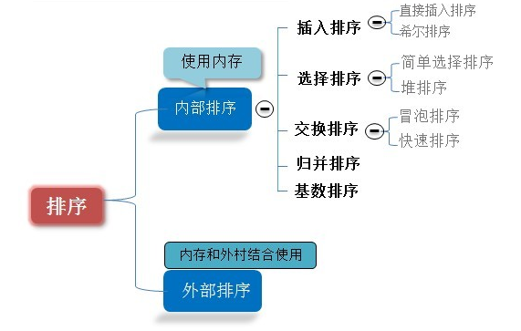
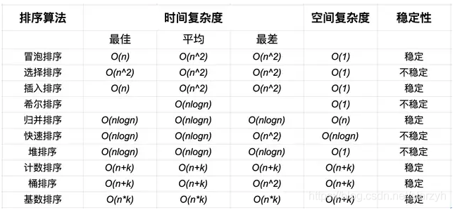

## 常见排序

### 一，插入排序
>Insertion Sort
#### （一）直接插入排序
>Straight Insertion Sort
##### 基本思想
>* 将一个记录插入到已排序好的有序表中，从而得到一个新，记录数增1的有序表。即：先将序列的第1个记录看成是一个有序的子序列，然后从第2个记录逐个进行插入，直至整个序列有序为止。
##### 代码实现
~~~c
void StraightInsertionSort(int *arr)
{
    int i, j;
    /*
    for (i=2; i<SIZE; i++)
    {
        if (arr[i] < arr[i-1])
        {
            arr[0] = arr[i];  //设置数组首元素为哨兵
            for (j=i-1; arr[j]>arr[0]; j--)
            {
                arr[j+1] = arr[j];
            }
            arr[j+1] = arr[0];
        }
    }
    */
   for (i=1; i<SIZE; i++) //首元素从第二个开始
    {
        if (arr[i] < arr[i-1])
        {
            int value = arr[i];  //没有设置数组首元素为哨兵
            for (j=i-1; j>=0 && arr[j]>value; j--)
            {
                arr[j+1] = arr[j];
            }
            arr[j+1] = value;
        }
    }
}
~~~
#### （二）折半排序
##### 基本思想
>* 在直接插入排序的基础上，在有序的子序列中运用折半查找确定插入位置。
##### 代码实现
~~~c
void BInsertSort(int *arr)
{
    int i, j, m, value, low, high;
    for (i=1; i<SIZE; i++)
    {
        low = 0;
        high = i-1;
        if (arr[i] < arr[i-1])
        {
            value = arr[i];
            while (low <= high)
            {
                m = (low+high)/2;
                if (arr[m]>value) 
                    high = m-1;
                else 
                    low = m+1;
            }
            for (j=i-1; j>=high+1; j--)
            {
                arr[j+1] = arr[j];
            }
            arr[j+1] = value; //arr[high+1] = value;
        }
    }
}
~~~
#### （三）希尔排序
##### 基本思想
>* 先将整个待排序的记录序列分割成为若干子序列分别进行直接插入排序，待整个序列中的记录“基本有序”时，再对全体记录进行依次直接插入排序。
##### 代码实现
~~~c
void shellSort(int *arr, int incresement)
{
    int i, j;

    for (i=incresement; i<SIZE; i++)
    {
        if (arr[i] < arr[i-incresement])
        {
            int value = arr[i];
            for (j=i-incresement; j>=0&&arr[j]>value; j=j-incresement)
            {
                arr[j+incresement] = arr[j];
            }
            arr[j+incresement] = value;
        }
    }
}
~~~