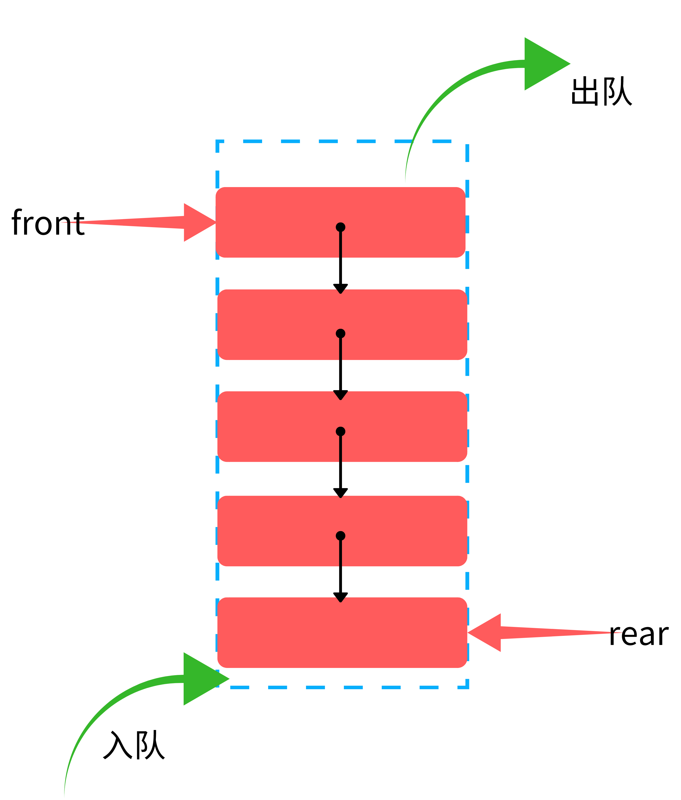

## 队列：链式存储实现
#### 一，概念及示意图
* 队列示意图

### 二，实现代码
#### （一）队列数据形式
~~~c
typedef struct node
{
    int data;
    struct node *pnext;
}Node, * Pnode;

typedef struct queue
{
    Pnode front;
    Pnode rear;
}Queue, * Pqueue;
~~~
#### （二）初始化队列
~~~c
void InitQueue(Pqueue queue)
{
    queue->front = (Pnode)malloc(sizeof(Node));
    if (queue->front == NULL)
    {
        puts("Can\'t locate the memory!");
        exit(EXIT_FAILURE);
    }
    queue->rear = queue->front;
}
~~~
#### （三）检测队列为空
~~~c
bool QueueIsEmpty(Pqueue queue)
{
    return (queue->front == queue->rear)? true:false;
}
~~~
#### （四）入队操作
~~~c
bool EnQueue(Pqueue queue)
{
    int data, ch;
    puts("Enter the data you want to enqueue:");
    while (scanf("%d", &data) != 1)
    {
        while ((ch = getchar()) != '\n')
        {
            putchar(ch);
        }
        puts(" is not a number! try again:");
    }
    EATLINE;
    Pnode newNode = (Pnode)malloc(sizeof(Node));
    newNode->data = data;
    newNode->pnext = NULL; 
    queue->rear->pnext = newNode;
    queue->rear = newNode;
    printf("Enter the %d successfully! \n", data);

    return true;
}
#### （五）出队操作
bool DeQueue(Pqueue queue)
{
    if (QueueIsEmpty(queue))
    {
        puts("The queue is empty!");
        return false;
    }
    int data;
    Pnode temp = queue->front->pnext;
    data = temp->data;
    queue->front->pnext = temp->pnext;
    
    if (temp == queue->rear)
    {
        queue->rear = queue->front;
    }
    free(temp);
    printf("Delete %d from the queue successfully!\n", data);

    return true;
}
~~~
#### （六）队列长度
~~~c
int QueueLength(Pqueue queue)
{
    int count = 0;
    if (QueueIsEmpty(queue))
    {
        puts("The queue is empty!");
        count = 0;
    }
    Pnode start = queue->front->pnext;
    
    while (start != NULL)
    {
        count++;
        start = start->pnext;
    }
    printf("The queue length:%d \n", count);
}
~~~
#### （七）打印队列
~~~c
void ShowQueue(Pqueue queue)
{
    if (QueueIsEmpty(queue))
    {
        puts("The queue is empty!");
        return;
    }
    Pnode start = queue->front->pnext;
    while (start != NULL)
    {
        printf("%d ", start->data);
        start = start->pnext;
    }
    putchar('\n');
}
~~~
#### （八）清空队列
~~~c
void ClearQueue(Pqueue queue)
{
    if (QueueIsEmpty(queue))
    {
        puts("The queue is empty!");
        return;
    }
    Pnode temp = queue->front;
    while (temp != NULL)
    {
        queue->front = queue->front->pnext;
        free(temp);
        temp = queue->front;
    }
    puts("clear the queue successfully!");
}
~~~