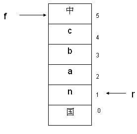
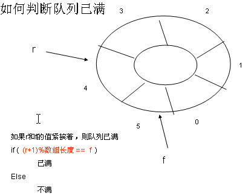

## 队列
### 一，顺序存储实现
>循环队列
#### （一）概念及示意图
* 队列示意图

* 入队出队示意图

* 判断队列满或空示意图

### 二，实现代码
#### （一）队列数据形式
~~~c
typedef struct Queue
{
    int *pbase;
    int front;
    int rear;
}QUEUE, * PQUEUE;
~~~
#### （二）初始化队列
~~~c
void InitQueue(PQUEUE queue)
{
    queue->pbase = (int *)malloc(sizeof(int) * SIZE);
    if ((queue->pbase) == NULL)
    {
        puts("Error in locating the memory!");
        exit(EXIT_FAILURE);
    }
    queue->front = 0;
    queue->rear = 0;
}
~~~
#### （三）检测队列为空或已满
~~~c
bool QueueIsEmpty(PQUEUE queue)
{
    return ((queue->front) == (queue->rear))? true:false;
}
bool QueueIsFull(PQUEUE queue)
{
    return (((queue->rear)+1 % SIZE) == (queue->front)) ? true:false;
}
~~~
#### （四）入队出队操作
~~~c
bool EnterQueue(PQUEUE queue)
{
    if (QueueIsFull(queue))
    {
        puts("The queue is full!");
        return false;
    }
    int data;
    (queue->pbase)[queue->rear] = data;
    queue->rear = (queue->rear+1)%SIZE;

    return true;
}

bool OutQueue(PQUEUE queue)
{
    if (QueueIsEmpty(queue))
    {
        puts("The queue is empty!");
        return false;
    }
    int data;
    data = (queue->pbase)[queue->front];
    queue->front = (queue->front+1)%SIZE;
    printf("The out queue data:%d \n", data);

    return true;
}
~~~
#### （五）遍历队列
~~~c
void TraverseQueue(PQUEUE queue, void(*pfunc)(int *data))
{
    if (QueueIsEmpty(queue))
    {
        puts("The queue is empty!");
        return;
    }
    int i = queue->front;
    while (i != queue->rear)
    {
        (*pfunc)(&(queue->pbase[i]));
        i = (i+1)%SIZE;
    }
}
~~~
#### （六）打印队列
~~~c
void ShowQueue(PQUEUE queue)
{
    if (QueueIsEmpty(queue))
    {
        puts("The queue is empty!");
        return;
    }
    int i = queue->front;
    while (i != queue->rear)
    {
        printf("%d ", (queue->pbase)[i]);
        i = (i+1)%SIZE;
    }
    putchar('\n');
}
~~~
#### （七）队列长度
~~~c
void QueueLength(PQUEUE queue)
{
    int i = queue->front;
    int count = 0;
    while (i != queue->rear)
    {
        count++;
        i = (i+1)%SIZE;
    }
    printf("The queue length:%d \n", count);
}
~~~
#### （八）清空队列
~~~c
void ClearQueue(PQUEUE queue)
{
    if (QueueIsEmpty(queue))
    {
        puts("The queue is empty!");
        return;
    }
    free(queue->pbase);
    puts("Clear queue successfully!");
}
~~~