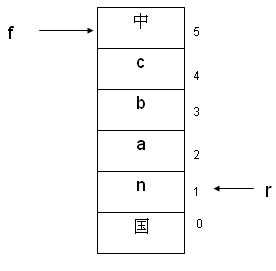
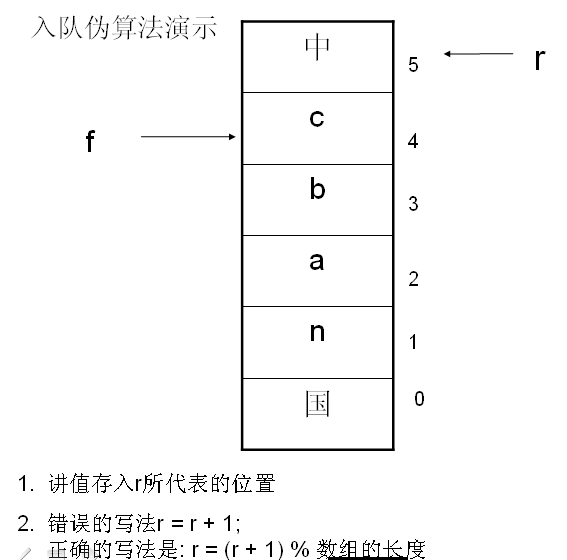
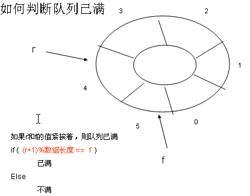

### 一，队列顺序存储实现
>循环队列
#### （一）概念及示意图
* 队列示意图

* 入队出队示意图

* 判断队列满或空示意图

### 二，实现代码
#### （一）队列数据形式
~~~java
class Node
{
    private int data;
    private String name;
    
    public Node(String name, int data)
    {
        this.name = name;
        this.data = data;
    }

    public String toString()
    {
        return "The name:"+this.name+" the data:"+this.data;
    }
}
~~~
#### （二）初始化队列
~~~java
public int length;
public int count;
public int front;
public int rear;
public Node[] queue;
public Queue(int length)
{
    this.length = length;
    queue = new Node[this.length];
    this.front = 0;
    this.rear = 0;
}
~~~
#### （三）检测队列为空或已满
~~~java
public boolean isEmpty()
{
    return this.front == this.rear;
}

public boolean isFull()
{
    return (this.rear+1)%this.length == this.front;
}
~~~
#### （四）入队出队操作
~~~c
public void EnQueue(Node target)
{
    if (this.isFull())
    {
        System.out.println("The queue is full!");
        return;
    }
    this.queue[this.rear] = target;
    this.rear = (this.rear+1)%this.length;
}

public Node DeQueue()
{
    if (this.isEmpty())
    {
        System.out.println("The queue is empty!");
        return null;
    }
    Node temp = this.queue[this.front];
    this.front = (this.front+1)%this.length;

    return temp;
}
~~~

#### （五）打印队列
~~~java
public void show()
{
    if (this.isEmpty())
    {
        System.out.println("The queue is empty!");
        return;
    }
    int i = this.front;
    while (i != this.rear)
    {
        System.out.println(this.queue[i]);
        i = (i+1)%this.length;
    }
}
~~~