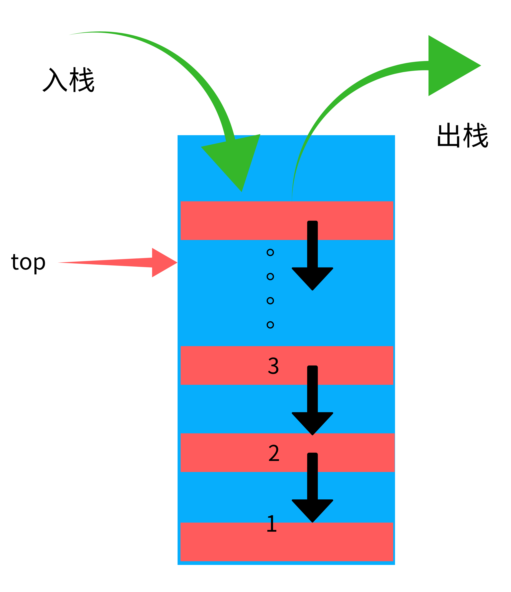

## 栈的链式存储实现

### 一，概念及示意图
* 栈的链式存储示意图

### 二，实现代码
#### （一）数据形式
~~~java
class Node
{
    private int data;
    private String name;
    public Node next;

    public Node(String name, int data)
    {
        this.data = data;
        this.name = name;
    }

    public String toString()
    {
        return "name:"+this.name+" data:"+this.data;
    }
}
~~~
#### （二）初始化
~~~java
public int length;
public Node top;
public Node bottom;
    
public Stack()
{
    this.top = new Node(null, 0);
    this.bottom = top;
    this.length = 0;
}

~~~
#### （三）检测为空
~~~java
public boolean isEmpty()
    {
        return this.top==this.bottom? true:false;
    }
~~~
#### （四）压栈操作
~~~java
public void push(Node target)
    {
        target.next = this.top;
        this.top = target;
        this.length++;
    }
~~~
#### （五）出栈操作
~~~java
public Node pop()
    {
        Node temp = this.top;
        this.top = temp.next;
        this.length--;
        return temp;
    }
~~~
#### （七）遍历操作
~~~java
public void show()
    {
        if (this.isEmpty())
        {
            System.out.println("The stack is empty!");
            return;
        }

        Node temp = this.top;
        while (temp != bottom)
        {
            System.out.println(temp);
            temp = temp.next;
        } 
        System.out.println("The stack deep:"+this.length);
    }
~~~
