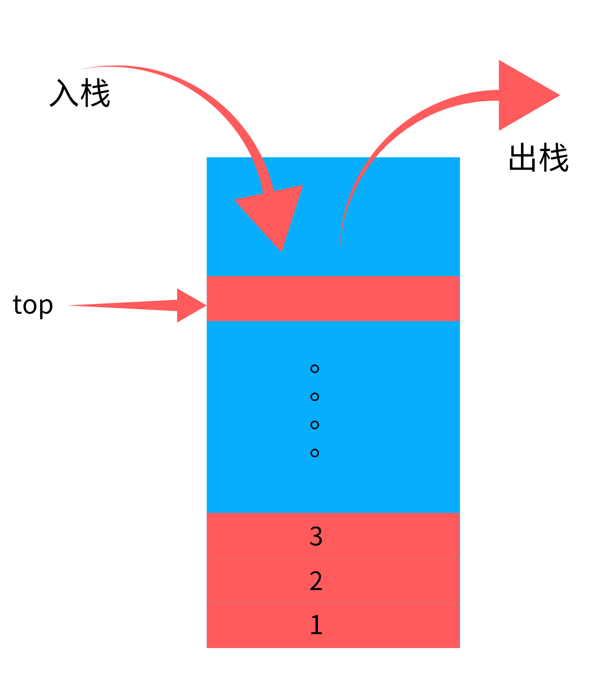

## 栈的顺序存储实现

### 一，概念及示意图
* 栈的顺序存储示意图

### 二，实现代码
#### （一）数据形式
~~~java
class Node
{
    public int data;
    public String name;

    public Node(String name, int data)
    {
        this.name = name;
        this.data = data;
    }

    public String toString()
    {
        return "name:"+this.name+" data:"+this.data;
    }
}
~~~
#### （二）初始化
~~~java
public Node[] stack;
public int top;
public int length;

public Stack(int length)
{
    stack = new Node[length];
    this.top = -1;
    this.length = length;
}
~~~
#### （三）检测为空或为满
~~~java
public boolean isEmpty()
    {
        return this.top == -1;
    }

public boolean isFull()
    {
        return this.top == this.length;
    }
~~~
#### （四）压栈操作
~~~java
public void push(Node target)
    {
        if (this.isFull())
        {
            System.out.println("The stack is full!");
            return;
        }
        this.top++;
        stack[this.top] = target;
        
        System.out.println("The push into the stack successfully!");
    }
~~~
#### （五）出栈操作
~~~java
public Node pop()
    {
        if (this.isEmpty())
        {
            System.out.println("The stack is empty!");
            return null;
        }
        Node temp = stack[this.top];
        this.top--;
        System.out.println("Pop successfully!");;
        return temp;
    }
~~~